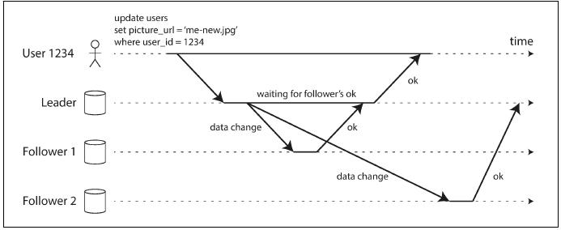
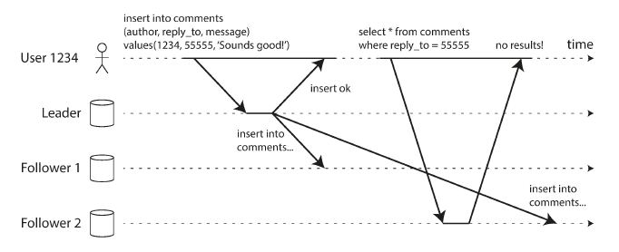
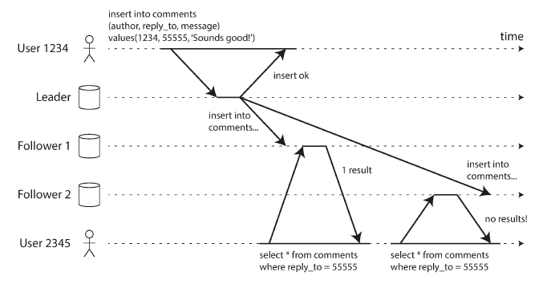
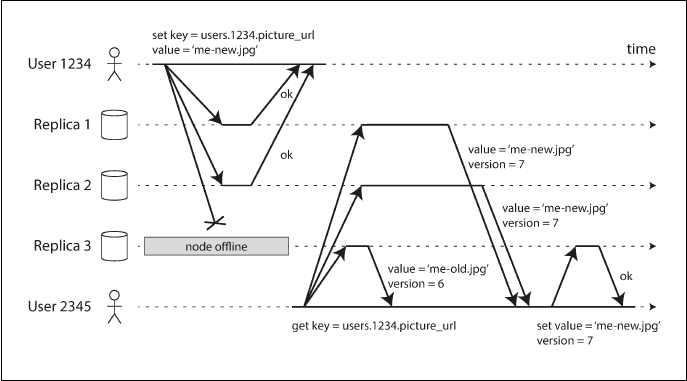

# Design principles for data intensive applications

## Replication

Replication means keeping a copy of the same data on multiple machines that are connected via a network. As discussed in the introduction to Part II, there are several
reasons why you might want to replicate data:
- To keep data geographically close to your users (and thus reduce latency)
- To allow the system to continue working even if some of its parts have failed(and thus increase availability)
- To scale out the number of machines that can serve read queries (and thus increase read throughput)

If data doesn't change, we need to copy just once. But that rarely is the case as data keeps changing, and hence one
of the major difficulty in replication is to ensure that all nodes receive latest data. Added concerns involve
are to decide on synchronous vs asynchronous replication, and how to handle failed replicas.

Most common solution for data replication is _**master-slave/active-passive**_. 
- One of the replica is designated as master/leader and clients send write requests to leader only which first writes
  data to its local storage
- Other replicas are followers/slaves,and master/leader sends new writes to other replicas as part of replication log/change stream,
  and they apply these writes to their local storage in same order as processed by master
- A client can send read request to master as well as slaves

Many relational databases already use this replication approach, as well as message brokers like kafka.

### Asynchronous vs synchronous replication

In image above, replication process follows synchronous approach with follower 1, and asynchronous approach with follower 2.

When a write request arrives at leader, it updates local storage and then sends the data to followers. With follower 1, leader
waits for confirmation and only after it is received, it sends success response to user and makes write visible to other users.
This approach has advantage that its guarantees that follower has same copy of data as leader,a nd if leader fails, follower can
be made leader. But if follower fails to respond due to network problems or due to failure of the node, leader has to block
all writes and wait till follower is available again.
With asynchronous replication with follower 2, master doesn't wait for response, and so data replication is not guaranteed.

It is impractical to make all followers synchronous because if one of the follower is unavailable, whole database system
would come to a halt. So a combination fo both approaches is preferred one. One of the follower is made synchronous while
others follow asynchronous replication. So if synchronous follower is unavailable or slow, one of the asynchronous follower
is made synchronous. This ensures that at a given time we have 2 up-to-date copies: master and synchronous follower.
Number of sync-async followers can be configured as per requirements.

### Handling node failures
Nodes in a distributed database system can go down due to machine failure, or due to maintenance. Few approaches are used
to make master-slave system highly available in case of node outages.

#### Follower failure: Catch-up recovery
When a failed follower node revives using the log from local storage, it detects the last transaction
it received from master, and so now it reconnects to master and requests all the writes which happened after that transaction.

#### Leader failure: Failover
Master/leader failure is much more complex than handling follower failure. A new leader has to be selected from the followers,
clients have to be reconfigured to now send writes to new leader, and followers now need to consume data from new leader.
This whole process is called **_Failover_**, and can be manual as well as automatic.
In automatic setup:
_ Leader failure is detected using health-checks
- New leader is elected using consensus algorithms, also taking into account which followers have most updated data
- Clients are reconfigure to send write requests to new leader
- If old leader comes back, it needs to be made a follower

Failover problems:
- One major issue in failover is that if new leader doesn't have the complete data from old leader, and it receives writes
which are conflicting with old leader then it may lead to data inconsistency issues, particularly if data is used by other systems.
For eg., suppose primary keys are generated using autoincrement strategy, then it may lead to a situation that new leader
generates primary keys already generated by old leader. Any other system using those primary
keys would be impacted, like a cache system.
- Sometimes, we end up with 2 nodes as leaders, causing a scenario called _**split-brain**_. This may cause data loss or corrupt
  data.
- How to decide what is right timeout before a leader is declared dead? If it's too long, then system may be without a leader
  even if leader is actually dead, making it unavailable as well as leading to longer recovery times as new leader is selection is also
  delayed. If its to short, we may be having too frequent failovers happening even if leader is not dead, thus stressing the system unnecessarily.

### Anamolies due to replication lag
#### Read after write

In distributed database systems, master-slave replication strategy generally used combination of synchronous and asynchronous
mode of replications. It's better to have synchronous replicas as low as possible as a single unavailable synchronous node
would block all write requests. But asynchronous replication has a major issue regarding consistency. As there is always a 
lag between data update reaching a follower from master, consistency is mostly eventual. If user reads in this time window from
lagging follower, then read is stale. In some cases it is not acceptable, for eg. when user reads immediately after writing data,
like profile update. If user updates his/her profile, and can't see the changes immediately then its really bad user experience.
There are few approaches to solve such issues:
- If user reads data he/she modifies, then read it from leader
- If most of the resources are modifiable by user, then always reading from leader beats purpose of master-slave replication
  strategy as reads are supposed to be mostly from followers to achieve objectives like scalability, low latency etc.
  In such cases, we can use a time window based approach, in which we track time of last update and read only from leader for
  some time, say 1 minute.

This read-after-write issue becomes more severe if user updates from one device and reads from another device, as different
devices have different latencies, application routing directs requests based on device and hence write and read requests
may be directed to different datacentres.

#### Monotonic reads

Another problem associated with replication lag is that consecutive reads for a user may give an impression of things moving 
back in time. This happens if first read request for a user goes to a replica node which has a record, and hence user
gets data in response. But next read request for same record goes to another replica node which still hasn't replicated the
data, and so user doesn't see the data.

Monotonic reads ensures that a user always sees the newer data, not older data. One way of achieving this is by sending
all requests from a user to same node, like by routing requests based on user id hash. Only when node fails that requests
are directed to other nodes.

### Consistent Prefix Reads
Another anamoly related to replication lag is violation of causality. Suppose order of data writes is critical, like in
a question-answer session.
Leader receives question and then answer. Due to replication lag, it may happen that observer reads answer before question.
This problem is more prevalent in distributed databases with multiple partitions, and as partitions operate independently,
it's difficult to ensure global write order. One way of ensuring write order can be to write causally related writes
to same partition.

### Multi-leader replication
TODO

### Leaderless replication
Some distributed databases don't follow leader-follower architecture. Instead, clients can send write requests to any replica.
In some versions of this architecture, clients send write requests to a coordinator node which then sends it to one of
the replica.

In leaderless architecture, when replicating a write if one of the replica is down, and configuration is fine with it,
when dead node comes back and starts serving read requests it may return stale data as it still doesn't have updated writes.
To avoid this, read request is send to multiple replicas and then latest one is selected.

#### Data consistency approaches
In leader based architectures, when a dead node comes back it fetches latest data form leader. In leaderless systems there
is no leader as such. So several other approaches are used to ensure data is replicated on all nodes:
- Read-repair: When it's detected during processing a read request that one of the replica has stale data, 
  latest data is written back to replica. This approach works quite well for data that is frequently read.
- Anti-entropy process: In this approach a background process continuously works to detect differences in data between replicas.
  and copies missing data from one replica to another.

#### Quorums
To ensure that we have multiple replicas of latest data, a write is successful only when it has been successfully written
to more than one node. It's called _**write quorum**_, say w. So a write request is successful only when w nodes out of n has
successful writes. Similarly **_read quorum_**, say r, decides how many nodes must read successfully for a read request to be successful.
If fewer than the required w or r nodes are available, writes or reads return an error.
To ensure that a read gets latest data,we must have w+r > n. 
These numbers are configurable in Dynamo based databases, like Cassandra. Generally n is some odd number, and w,r are set to (n+1)/2 rounded up.

#### Limitations of Quorum Consistency
TODO

# SQL
Order of execution in a SQL query:
- FROM [MyTable]
- ON [MyCondition]
- JOIN [MyJoinedTable]
- WHERE [...]
- GROUP BY [...]
- HAVING [...]
- SELECT [...]
- ORDER BY [...]
- LIMIT

- JOIN/INNER JOIN : Fetch all rows which match the join criteria
- LEFT JOIN: INNER JOIN + all other records from table on left of join
- RIGHT JOIN: INNER JOIN + all other records from table on right of join
- Multiple JOINS: Join initiated from left and progressively joins the result with next table

https://www.sqlshack.com/learn-sql-sql-query-practice/